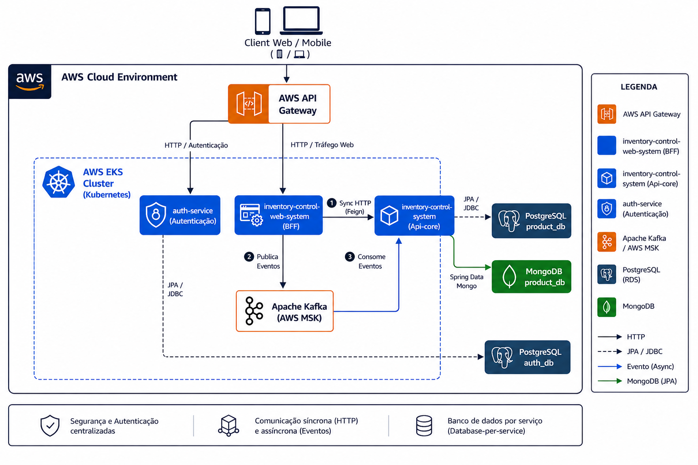
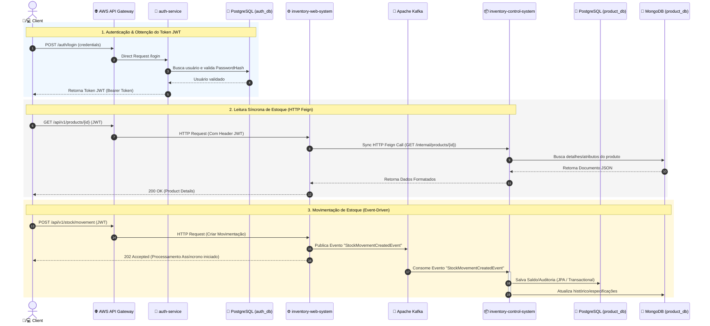

# 🏢 General Inventory Control System

[](https://spring.io/projects/spring-boot)
[](https://aws.amazon.com/eks/)
[](https://aws.amazon.com/msk/)
[](https://aws.amazon.com/)
[](https://www.oracle.com/java/)

> **Repositório Central de Arquitetura e Orquestração**  
> Ecossistema de microsserviços distribuídos para controle e gestão de estoque, projetado com foco em resiliência, escalabilidade, persistência poliglota e padrões avançados de nuvem.

---

## 📐 Visão Geral da Arquitetura

O sistema adota uma arquitetura orientada a microsserviços rodando sobre um cluster **AWS EKS (Kubernetes)**, orquestrado através do **AWS API Gateway** e com persistência desacoplada seguindo o padrão *Database-per-Service*.



---

## 🏛️ Padrões e Decisões Arquiteturais

### 1. **Backend For Frontend (BFF) Pattern**
* **Serviço:** `inventory-control-web-system`
* **Papel:** Atua como ponto único de entrada de tráfego de negócio para clientes Web e Mobile. Isola a camada de apresentação das regras complexas de domínio, orquestrando chamadas e agregando respostas sem possuir banco de dados próprio.

### 2. **Comunicação Híbrida (Síncrona + Assíncrona)**
* **Síncrona (Sync):** Comunicação em tempo real via **OpenFeign** (HTTP) para consultas e validações imediatas entre o BFF e a Core API.
* **Assíncrona (Async):** Publicação de eventos de movimentação no **Apache Kafka (AWS MSK)** para processamento desacoplado e resiliente na Core API.

### 3. **Persistência Poliglota (Polyglot Persistence)**
* **PostgreSQL (RDS - `product_db`):** Armazena dados relacionais estruturados que exigem consistência ACID, tais como categorias, saldos e dados contábeis de estoque.
* **MongoDB (`product_db`):** Armazena catálogos dinâmicos de produtos, atributos variáveis e esquemas flexíveis.

### 4. **Isolamento de Segurança & Autenticação Centralizada**
* **Serviço:** `auth-service`
* **Papel:** Responsável pelo gerenciamento de credenciais, RBAC (Role-Based Access Control) e emissão de tokens **JWT (JSON Web Token)** com persistência exclusiva no **PostgreSQL (`auth_db`)**.

---

## 🧩 Componentes do Ecossistema

O repositório pai organiza os repositórios/módulos individuais do ecossistema:

| Microsserviço | Responsabilidade | Stack Principal | Banco de Dados |
| :--- | :--- | :--- | :--- |
| [🔐 **auth-service**](./auth-service) | Autenticação, Autorização e JWT | Spring Security, JPA/Hibernate | PostgreSQL (`auth_db`) |
| [⚙️ **inventory-control-web-system**](./inventory-control-web-system) | BFF (Backend for Frontend) | Spring Boot, Spring Cloud Feign, Kafka Producer | *Stateless* (Sem BD) |
| [📦 **inventory-control-system**](./inventory-control-system) | Core API (Regras de Negócio de Estoque) | Spring Boot, Kafka Consumer, Spring Data | PostgreSQL + MongoDB (`product_db`) |

---


## ⏱️ Diagrama de Sequência (Fluxo de Negócio & Eventos)

O diagrama abaixo ilustra o ciclo de vida completo de uma requisição de movimentação de estoque, desde a autenticação até a persistência assíncrona dos dados:



---

## 🔄 Fluxo de Dados e Comunicação

1. **Autenticação:**  
   `Client` ➔ `AWS API Gateway` ➔ `auth-service` ➔ Consulta `PostgreSQL (auth_db)` ➔ Valida credenciais e retorna o Token JWT.

2. **Tráfego de Negócio (Consultas Síncronas):**  
   `Client` ➔ `AWS API Gateway` ➔ `inventory-control-web-system (BFF)` ➔ `HTTP Feign` ➔ `inventory-control-system (Core)` ➔ Leitura no `PostgreSQL` / `MongoDB`.

3. **Movimentações de Estoque (Processamento por Eventos):**  
   `Client` ➔ `inventory-control-web-system (BFF)` ➔ Publica Evento no `Apache Kafka` ➔ `inventory-control-system (Core)` consome o evento e atualiza o estado dos bancos de dados.

---

## 🔌 Principais Endpoints (API Gateway)

| Método | Endpoint | Autenticação | Descrição |
| :--- | :--- | :--- | :--- |
| `POST` | `/api/v1/auth/login` | Público | Autentica o usuário e retorna o Token JWT. |
| `GET` | `/api/v1/products/{id}` | Bearer JWT | Consulta síncrona dos detalhes de um produto. |
| `POST` | `/api/v1/stock/movement` | Bearer JWT | Processa movimentação de estoque de forma assíncrona. |

---

## 🧠 Justificativas Técnicas (ADR Summary)

* **Por que PostgreSQL + MongoDB (Polyglot Persistence)?**
  * **PostgreSQL:** Escolhido para controle financeiro, saldos e auditoria de estoque pela garantia de transações ACID.
  * **MongoDB:** Escolhido para o catálogo de produtos devido ao esquema flexível (atributos dinâmicos por categoria sem alteração de DDL).
* **Por que Kafka em vez de REST em todas as chamadas?**
  * Para garar **alta disponibilidade e resiliência** nas movimentações de estoque, evitando timeout da API sob alto tráfego e garantindo processamento em fila.

---

## 🚀 Como Executar Localmente

### Pré-requisitos
* **Java 17+**
* **Docker** e **Docker Compose**
* **Maven 3.9+**

---


## 🧪 Testes e Validação

Para executar a suíte de testes integrados e unitários de todos os módulos do projeto, utilize o comando abaixo:

```bash
# Executa os testes unitários e de integração de todos os módulos
mvn clean test
```

### 1. Clonar o repositório principal e submódulos
```bash
git clone [https://github.com/ewertonss1995/General-inventory-control-system.git](https://github.com/ewertonss1995/General-inventory-control-system.git)
cd General-inventory-control-system