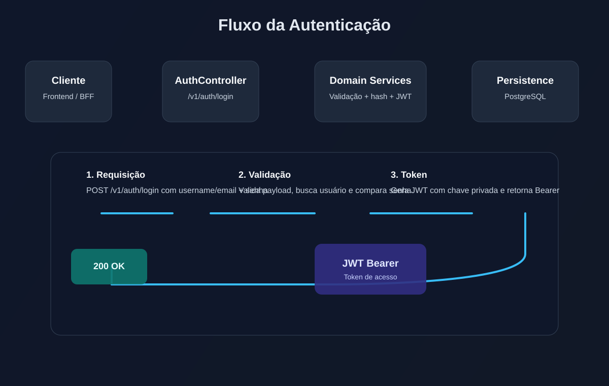
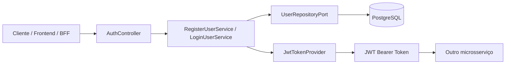
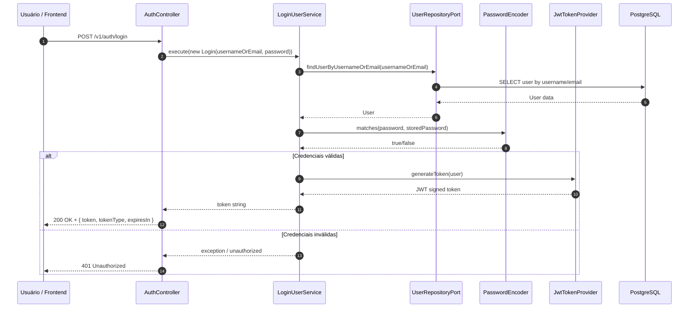

# Auth Service - Controle de Acesso 🚀

[](https://www.oracle.com/java/)
[](https://spring.io/projects/spring-boot)
[](https://jwt.io/)
[](https://www.postgresql.org/)
[](https://swagger.io/)

Este repositório contém o microsserviço de autenticação e autorização do ecossistema de controle de estoque, implementado em Java com Spring Boot. A aplicação é responsável por registrar usuários, autenticar credenciais e emitir tokens JWT para proteger os demais serviços do sistema.

## 📌 Arquitetura da Aplicação

* **API REST segura** exposta em `http://localhost:8082`.
* **Fluxo de autenticação baseado em JWT** com assinatura RSA e validação pública.
* **Persistência em PostgreSQL** para armazenamento de usuários e perfis.
* **Arquitetura em camadas** seguindo Clean Architecture / Hexagonal, com separação clara entre domínio, casos de uso e infraestrutura.
* **Observabilidade nativa** com Actuator, Prometheus e rastros OpenTelemetry.


## 🔄 Fluxo de Autenticação e Registro

O processo de acesso foi desenhado para garantir segurança, rastreabilidade e rastreio de operações críticas:

1. O cliente envia uma requisição para `/v1/auth/register` ou `/v1/auth/login`.
2. O controlador valida a entrada e encaminha os dados para os casos de uso do domínio.
3. O serviço de domínio valida regras de negócio, criptografa a senha e consulta o banco.
4. Em caso de login bem-sucedido, o token JWT é gerado e retornado ao cliente em formato Bearer.
5. Os demais serviços podem validar o token usando a chave pública pública do serviço.





### Diagrama de Sequência



## 🛠️ Como Executar o Projeto

### Pré-requisitos

* Java 17+
* Maven 3.9+
* PostgreSQL em execução
* Docker (opcional)

### 1. Clone o projeto

```bash
git clone <url-do-repositorio>
cd auth-service
```

### 2. Configure as variáveis de ambiente

O projeto usa as seguintes variáveis para conectar ao banco e controlar a aplicação:

```bash
export POSTGRES_DB_HOST=localhost
export POSTGRES_DB_PORT=5433
export POSTGRES_DB_NAME=auth_db
export POSTGRES_DB_USERNAME=postgres
export POSTGRES_DB_PASSWORD=SenhaSuperSegura123!
```

### 3. Execute a aplicação

```bash
./mvnw clean install
./mvnw spring-boot:run
```

A aplicação estará disponível em:

```text
http://localhost:8082
```

### 4. Executar com Docker

```bash
docker build -t auth-service .
docker run -p 8082:8082 --env-file .env auth-service
```

## 🌐 Endpoints Principais

### Registro de usuário

```http
POST /v1/auth/register
Content-Type: application/json
```

```json
{
  "username": "joao.silva",
  "email": "joao@empresa.com",
  "password": "Senha@123"
}
```

Resposta esperada:

```http
201 Created
```

### Login

```http
POST /v1/auth/login
Content-Type: application/json
```

```json
{
  "usernameOrEmail": "joao.silva",
  "password": "Senha@123"
}
```

Resposta esperada:

```json
{
  "token": "eyJhbGciOiJSUzI1NiIsInR5cCI6IkpXVCJ9...",
  "tokenType": "Bearer",
  "expiresIn": 7200
}
```

### Swagger / OpenAPI

```text
http://localhost:8082/swagger-ui.html
```

### Health check / Métricas

```text
http://localhost:8082/actuator/health
http://localhost:8082/actuator/prometheus
```

## 🔒 Camada de Segurança e Persistência

* **Autenticação stateless** com tokens JWT sem armazenamento em sessão.
* **Criptografia de senha** com `BCryptPasswordEncoder`.
* **Chaves RSA** armazenadas em `src/main/resources/certs/` para assinatura e validação dos tokens.
* **Spring Security** com validação de acessos por rotas e políticas de autorização.
* **Banco PostgreSQL** isolado e configurado para persistência de usuários e roles.
* **Flyway** gerencia as migrations do banco de dados automaticamente.
* **Skips de segurança** e políticas de validação em produção incluídas no desenho do serviço.

## 📊 Observabilidade e Monitoramento

* **Actuator** para health check e informações do serviço.
* **Micrometer + Prometheus** para métricas de negócio e infraestrutura.
* **OpenTelemetry + tracing** para rastreamento distribuído.
* **Logs estruturados** com trace IDs e span IDs para diagnóstico de requisições.

## 🧱 Estrutura do Projeto

```text
auth-service/
├── src/
│   ├── main/
│   │   ├── java/
│   │   │   └── com/auth/
│   │   │       ├── adapters/
│   │   │       ├── domain/
│   │   │       ├── infrastructure/
│   │   │       └── ports/
│   │   └── resources/
│   │       ├── application.yml
│   │       ├── certs/
│   │       └── db/migration/
│   └── test/
├── Dockerfile
├── pom.xml
├── mvnw
├── README.md
└── .gitignore
```

## ✅ Características do Serviço

* Cadastro de usuários com perfil e regras de negócio.
* Login por username ou email.
* Emissão de JWT com TTL configurável.
* Autorização baseada em roles e authorities.
* Documentação OpenAPI/Swagger integrada.
* Pronto para integração com outros microsserviços do ecossistema.

## 📎 Observações Finais

Este microsserviço atua como a camada de identidade do sistema, permitindo que outros componentes autentiquem usuários de forma segura e centralizada. Com uma base em Java Spring Boot, autenticação JWT e observabilidade pronta, ele fornece integração robusta com o restante da arquitetura de controle de estoque.

---

Se precisar, este README pode ser adaptado também para uma versão com foco em:

* arquitetura na AWS;
* onboarding de desenvolvedores;
* documentação para integração com frontend/BFF;
* apresentação para stakeholders técnicos.
