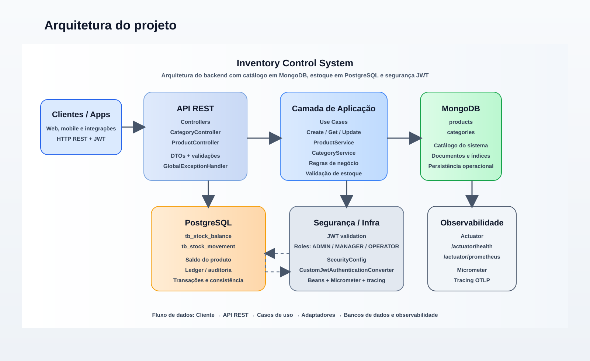
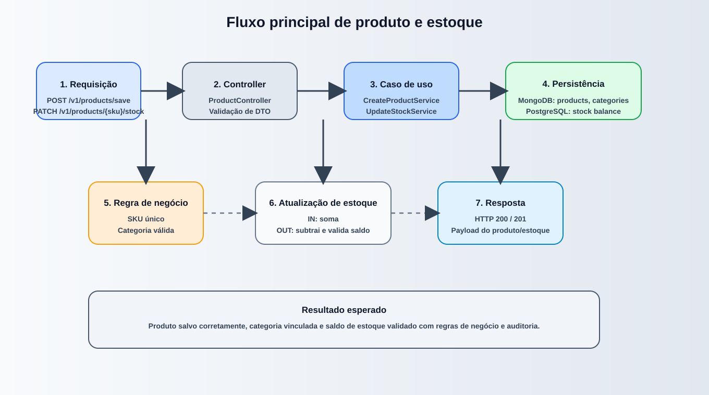
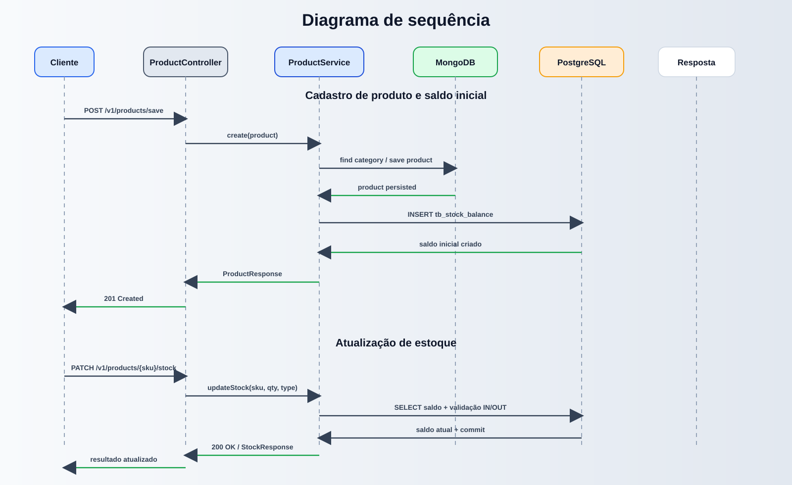

# Inventory Control System

[](https://www.oracle.com/java/)
[](https://spring.io/projects/spring-boot)
[](https://spring.io/projects/spring-security)
[](https://www.postgresql.org/)
[](https://www.mongodb.com/)

Sistema backend para gestão de catálogo de produtos, categorias e controle de estoque em tempo real, desenvolvido com Java 17 e Spring Boot 3.3.2.

O projeto adota uma abordagem de arquitetura hexagonal, separando domínio, casos de uso, adaptadores de entrada/saída e infraestrutura, com autenticação via JWT, persistência poliglota (MongoDB + PostgreSQL) e observabilidade com Micrometer, Prometheus e tracing OTLP.

## Visão geral

Este backend foi projetado para atender cenários de gestão de estoque com foco em:

- cadastro e consulta de categorias;
- cadastro, atualização e listagem de produtos;
- movimentação de estoque com validação de saldo e regras de negócio;
- autenticação e autorização por roles JWT;
- persistência de dados em múltiplos bancos conforme a natureza do dado;
- monitoramento e métricas para operação em produção.

## Arquitetura do projeto



### Principais componentes

- Camada de entrada: controllers REST em `adapters/in/web`;
- Camada de aplicação: casos de uso em `domain/service` e `ports/in`;
- Dominio: modelos e regras de negócio em `domain/model` e `domain/exception`;
- Adaptadores de persistência: MongoDB para catálogo e PostgreSQL para saldo/ledger;
- Infraestrutura: segurança JWT, configuração de beans e observabilidade;
- Observabilidade: `/actuator/health`, `/actuator/prometheus`, métricas Micrometer e tracing.

## Fluxo de negócio principal



### Diagrama de sequência



### 1) Cadastro de categoria

- O cliente envia uma requisição para `POST /v1/categories/save`;
- o controller converte o payload para o modelo de domínio;
- o caso de uso valida os dados e persiste a categoria no MongoDB;
- a resposta retorna o recurso criado com status `201 Created`.

### 2) Cadastro de produto

- `POST /v1/products/save` recebe SKU, nome, preço, quantidade e categoria;
- o sistema valida se o SKU é único e se a categoria existe;
- o produto é salvo no MongoDB como documento de catálogo;
- o saldo inicial é registrado no PostgreSQL em `tb_stock_balance`;
- o retorno inclui o ID do produto e o saldo inicial.

### 3) Atualização de estoque

- `PATCH /v1/products/{sku}/stock` aceita `quantity` e `movementType`;
- o domínio valida a regra de negócio:
  - `IN` incrementa o saldo;
  - `OUT` reduz o saldo;
  - se a quantidade for maior que o saldo atual, dispara erro de negócio;
- o saldo correspondente é atualizado no PostgreSQL;
- a operação respeita as regras de autorização por perfil.

## Tecnologias e stack

- Java 17
- Spring Boot 3.3.2
- Spring Web
- Spring Data JPA
- Spring Data MongoDB
- Spring Security + OAuth2 Resource Server
- JWT com chave pública
- Flyway
- PostgreSQL
- MongoDB
- Micrometer + Actuator + Prometheus
- JaCoCo para cobertura de testes
- Lombok e MapStruct

## Estrutura de diretórios

```text
inventory-control-system/
├── src/
│   ├── main/
│   │   ├── java/
│   │   │   └── com/inventory/control/system/
│   │   │       ├── adapters/
│   │   │       │   ├── in/web/
│   │   │       │   └── out/
│   │   │       ├── domain/
│   │   │       │   ├── exception/
│   │   │       │   ├── model/
│   │   │       │   └── service/
│   │   │       ├── infrastructure/
│   │   │       └── ports/
│   │   └── resources/
│   │       ├── certs/
│   │       ├── db/migration/
│   │       ├── application.yml
│   │       └── application-dev.yml
│   └── test/java/
│       └── ... testes unitários
├── Dockerfile
├── pom.xml
├── mvnw
├── .env.example
├── HELP.md
├── docs/
│   ├── architecture-overview.svg
│   ├── api-flow.svg
│   └── sequence-diagram.svg
├── target/
└── README.md
```

## Persistência e arquitetura de dados

O sistema utiliza uma abordagem de armazenamento poliglota:

- MongoDB: catálogo de produtos e categorias;
- PostgreSQL: saldo de estoque e histórico de movimentações.

### Dados no MongoDB

- `products`
- `categories`

### Dados no PostgreSQL

- `tb_stock_balance`
- `tb_stock_movement`

A estratégia foi pensada para separar:

- conteúdo de catálogo e metadados do produto;
- saldo financeiro/operacional de estoque;
- rastreabilidade e auditoria de movimentações.

## Autenticação e autorização

A API exige autenticação JWT com roles definidos no token. A configuração atual permite:

- `ROLE_ADMIN`
- `ROLE_MANAGER`
- `ROLE_OPERATOR`

As regras atuais do `SecurityConfig` são:

- `GET` em produtos e categorias: `ROLE_ADMIN`, `ROLE_MANAGER`, `ROLE_OPERATOR`
- `POST` e `PUT`: `ROLE_ADMIN`, `ROLE_MANAGER`
- `PATCH` para estoque: `ROLE_ADMIN`, `ROLE_MANAGER`
- qualquer outra rota: exige autenticação

A chave pública usada para validação do JWT é carregada a partir de:

- `src/main/resources/certs/app.pub`
- ou por variável de ambiente: `JWT_PUBLIC_KEY_PATH`

## Endpoints principais

| Método | Endpoint | Descrição | Permissões |
|---|---|---|---|
| `POST` | `/v1/categories/save` | Cria categoria | `ROLE_ADMIN`, `ROLE_MANAGER` |
| `PUT` | `/v1/categories/update/{id}` | Atualiza categoria | `ROLE_ADMIN`, `ROLE_MANAGER` |
| `GET` | `/v1/categories` | Lista categorias | `ROLE_ADMIN`, `ROLE_MANAGER`, `ROLE_OPERATOR` |
| `GET` | `/v1/categories/{id}` | Busca categoria por ID | `ROLE_ADMIN`, `ROLE_MANAGER`, `ROLE_OPERATOR` |
| `POST` | `/v1/products/save` | Cria produto | `ROLE_ADMIN`, `ROLE_MANAGER` |
| `PUT` | `/v1/products/update/{sku}` | Atualiza produto | `ROLE_ADMIN`, `ROLE_MANAGER` |
| `GET` | `/v1/products` | Lista todos os produtos | `ROLE_ADMIN`, `ROLE_MANAGER`, `ROLE_OPERATOR` |
| `GET` | `/v1/products/{sku}` | Busca produto por SKU | `ROLE_ADMIN`, `ROLE_MANAGER`, `ROLE_OPERATOR` |
| `PATCH` | `/v1/products/{sku}/stock` | Movimenta estoque | `ROLE_ADMIN`, `ROLE_MANAGER` |

## Regras do domínio

O sistema valida regras importantes para garantir integridade:

- SKU obrigatório e único;
- nome do produto obrigatório;
- categoria obrigatória para criação/atualização de produto;
- preço deve ser maior ou igual a zero;
- quantidade de estoque deve ser maior ou igual a zero;
- movimentação de saída não pode ultrapassar o saldo atual;
- estados inválidos geram `BusinessException` e resposta HTTP 400.

## Observabilidade

O projeto expõe informações de monitoramento via Spring Actuator:

- `/actuator/health`
- `/actuator/info`
- `/actuator/metrics`
- `/actuator/prometheus`

Além disso, o `application.yml` configura:

- métricas com Micrometer;
- tracing com OTLP;
- tags de aplicação para observabilidade centralizada.

## Configuração de ambiente

As variáveis de ambiente esperadas são:

```bash
export POSTGRES_DB_HOST=localhost
export POSTGRES_DB_PORT=5433
export POSTGRES_DB_NAME=inventory_db
export POSTGRES_DB_USERNAME=postgres
export POSTGRES_DB_PASSWORD=SenhaSuperSegura123!

export MONGO_HOST=localhost
export MONGO_PORT=27018
export MONGO_DB_NAME=inventory_db
export MONGO_USERNAME=admin
export MONGO_PASSWORD=SenhaSuperSegura123!
export MONGO_AUTH_DB=admin

export JWT_PUBLIC_KEY_PATH=classpath:certs/app.pub
```

Um exemplo pronto para uso está disponível em `.env.example`:

```bash
cp .env.example .env
```

> O projeto foi configurado com portas locais padrão para PostgreSQL e MongoDB. Certifique-se de que ambos estejam disponíveis antes de iniciar a aplicação.

## Executando o projeto localmente

### 1) Compile e empacote a aplicação

```bash
./mvnw clean package
```

### 2) Inicie a aplicação

```bash
./mvnw spring-boot:run
```

ou diretamente com o JAR gerado:

```bash
java -jar target/inventory-control-system-0.0.1-SNAPSHOT.jar
```

### 3) Acesse a API

A aplicação estará disponível em:

```text
http://localhost:8081
```

### 4) Executar com Docker

```bash
docker build -t inventory-control-system .
docker run -p 8081:8081 --env-file .env inventory-control-system
```

Se a equipe preferir, a imagem também pode ser orquestrada em um ambiente de containers com PostgreSQL e MongoDB em separado.

## Testes unitários

### Executar toda a suíte

```bash
./mvnw test
```

### Executar testes específicos

```bash
./mvnw test -Dtest=ProductControllerTest,CategoryControllerTest
```

### Resultado verificado

A suíte foi executada e validada no ambiente atual com os seguintes resultados:

- 87 testes executados
- 0 falhas
- 0 erros
- 0 testes ignorados

## Checklist de execução rápida

```bash
# 1. Verifique se PostgreSQL e MongoDB estão ativos
# 2. Configure as variáveis de ambiente
# 3. Gere o pacote
./mvnw clean package

# 4. Execute a aplicação
./mvnw spring-boot:run

# 5. Valide o healthcheck
curl http://localhost:8081/actuator/health

# 6. Rode os testes
./mvnw test
```

## Observações finais

Este projeto representa uma solução robusta para gestão de catalogação e estoque, com foco em:

- separação clara de responsabilidades;
- domínio fortemente validado;
- persistência adequada por tipo de dado;
- autenticação por token JWT;
- monitoramento e rastreabilidade operacional.

A estrutura foi organizada para facilitar evolução, manutenção e extensão para novas regras de negócio, integrações e módulos.
