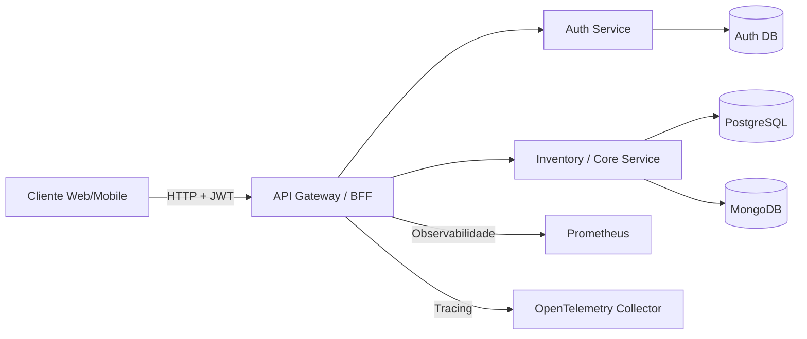
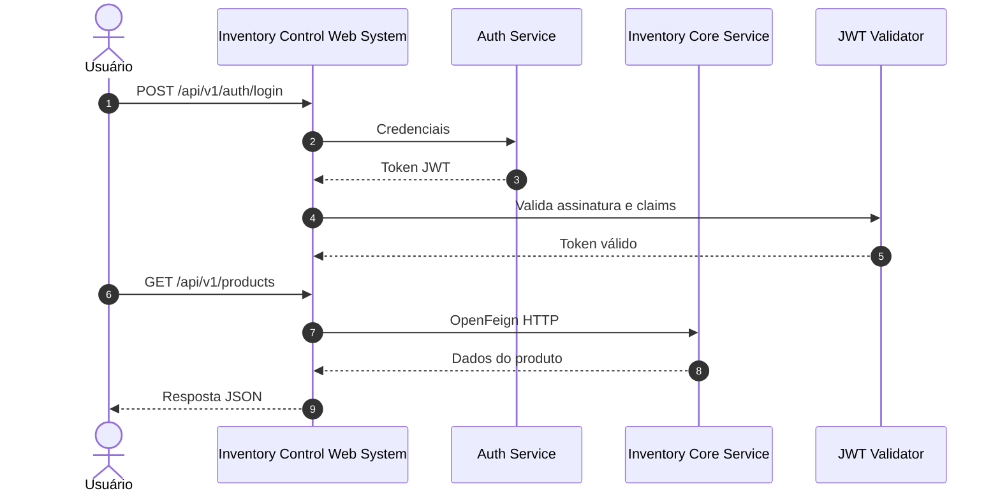

# Inventory Control Web System

[](https://www.oracle.com/java/)
[](https://spring.io/projects/spring-boot)
[](https://github.com/OpenFeign/feign)
[](https://jwt.io/)
[](https://swagger.io/)

## Visão geral

O `inventory-control-web-system` é um backend de aplicação do tipo BFF (Backend for Frontend), responsável por expor uma camada de integração para clientes web/mobile e orquestrar as operações de autenticação, produtos e categorias em outros microsserviços do ecossistema.

Este módulo é totalmente stateless, ou seja, não mantém dados de negócio em banco próprio. Sua responsabilidade principal é:

- autenticar usuários e validar tokens JWT;
- receber requisições do cliente;
- chamar serviços downstream via HTTP com OpenFeign;
- aplicar regras de autorização e segurança do lado do gateway de API;
- expor documentação e métricas observáveis para operação e monitoramento.

Em termos práticos, este projeto atua como porta de entrada para o sistema de controle de estoque e centraliza a integração com os serviços de autenticação e domínio.

---

## Objetivo do projeto

O sistema foi desenhado para gerenciar:

- autenticação e autorização de usuários;
- cadastro e consulta de produtos;
- cadastro e consulta de categorias;
- atualização de estoque;
- integração com serviços backend especializados, preservando separação de responsabilidades.

A arquitetura segue o padrão de microsserviços, em que este projeto funciona como camada de adaptação e orquestração, sem alocar lógica de domínio ou dados locais.

---

## Arquitetura e fluxo de funcionamento

### Visão arquitetural em diagramas





### 1. Autenticação e autorização

Fluxo principal do login:

1. O cliente envia `POST /api/v1/auth/login`.
2. O BFF encaminha a requisição para o serviço de autenticação externo.
3. O serviço de autenticação valida as credenciais e retorna um token JWT.
4. O BFF valida o token usando chave pública pública configurada no projeto.
5. As requisições subsequentes passam pelo filtro de segurança do Spring Security e exigem roles configuradas.

O projeto utiliza:

- Spring Security
- OAuth2 Resource Server
- JWT com validação por chave pública
- conversão de claims para autoridades (roles)

### 2. Consulta de produtos e categorias

Fluxo típico de leitura:

1. O cliente chama `GET /api/v1/products` ou `GET /api/v1/categories`.
2. O controller recebe a requisição.
3. O BFF delega a chamada ao microsserviço de inventory via Feign.
4. O backend retorna os dados estruturados.
5. O BFF monta o payload e devolve a resposta ao cliente.

### 3. Criação e atualização

Para criação/atualização de produtos e categorias:

1. O cliente envia os dados em JSON.
2. O BFF valida o payload.
3. O BFF converte o modelo da camada web para o modelo interno da aplicação.
4. A comunicação com o serviço downstream acontece via OpenFeign.
5. A resposta é transformada em DTO final e devolvida ao cliente.

### 4. Atualização de estoque

O fluxo de atualização de saldo é uma operação sensível e protegida por regras de autorização:

1. O cliente envia `PATCH /api/v1/products/{sku}/stock`.
2. O controller valida entrada e tipo de movimentação.
3. O serviço de domínio executa a operação.
4. O BFF encaminha a atualização para o backend de estoque.
5. O backend responde com novo saldo e informações da movimentação.

### 5. Observabilidade e monitoramento

A aplicação expõe endpoints de monitoramento e métricas usando Spring Actuator e Micrometer:

- `/actuator/health`
- `/actuator/metrics`
- `/actuator/prometheus`

Traces são emitidos com OpenTelemetry e podem ser enviados para um collector OTLP.

---

## Tecnologias e stack

### Backend

- Java 17
- Spring Boot 3.3.4
- Spring Web
- Spring Validation
- Spring Security
- Spring OAuth2 Resource Server
- Spring Cloud OpenFeign
- MapStruct
- Logback + Logstash
- Actuator
- Micrometer + Prometheus

### Documentação e integração

- SpringDoc OpenAPI / Swagger UI
- DTOs e mapeamento com MapStruct

### Infraestrutura / observabilidade

- Caffeine Cache
- Micrometer Tracing
- OpenTelemetry OTLP
- Prometheus export

### Comunicação com serviços externos

- OpenFeign para integração síncrona com:
  - serviço de autenticação
  - serviço de inventory/core do sistema

---

## Estrutura do projeto

```text
inventory-control-web-system/
├── src/
│   ├── main/
│   │   ├── java/
│   │   │   └── com/inventory/control/web/system/
│   │   │       ├── adapters/
│   │   │       │   ├── in/web/
│   │   │       │   └── out/
│   │   │       ├── domain/
│   │   │       ├── infrastructure/
│   │   │       └── ports/
│   │   └── resources/
│   │       ├── application.yml
│   │       └── certs/
│   └── test/
│       └── java/
├── Dockerfile
├── pom.xml
├── mvnw
├── mvnw.cmd
├── .gitignore
└── README.md
```

Principais módulos implementados:

- `adapters.in.web` — controllers REST
- `adapters.out.auth` — integração com o serviço de autenticação
- `adapters.out.client` — integração com o serviço de inventory
- `domain` — regras e modelos de negócio
- `infrastructure` — segurança, configurações, interceptors, decoders, cache
- `ports` — contratos entre camadas

---

## Endpoints principais

### Autenticação

| Método | Endpoint | Descrição | Autenticação |
| --- | --- | --- | --- |
| `POST` | `/api/v1/auth/register` | Registro de usuário | Pública |
| `POST` | `/api/v1/auth/login` | Geração de token JWT | Pública |

### Produtos

| Método | Endpoint | Descrição | Autenticação |
| --- | --- | --- | --- |
| `POST` | `/api/v1/products/save` | Criação de produto | Requer role |
| `PUT` | `/api/v1/products/update/{sku}` | Atualização de produto | Requer role |
| `GET` | `/api/v1/products` | Listagem de produtos | Requer role |
| `GET` | `/api/v1/products/{sku}` | Busca por SKU | Requer role |
| `PATCH` | `/api/v1/products/{sku}/stock` | Atualização de estoque | Requer role |

### Categorias

| Método | Endpoint | Descrição | Autenticação |
| --- | --- | --- | --- |
| `POST` | `/api/v1/categories/save` | Criação de categoria | Requer role |
| `PUT` | `/api/v1/categories/update/{id}` | Atualização de categoria | Requer role |
| `GET` | `/api/v1/categories` | Listagem de categorias | Requer role |
| `GET` | `/api/v1/categories/{id}` | Busca por categoria | Requer role |

> O projeto aplica regras por autorizações: `ROLE_ADMIN`, `ROLE_MANAGER` e `ROLE_OPERATOR`.

### Documentação

- Swagger UI: `http://localhost:8080/swagger-ui/index.html`
- OpenAPI: `http://localhost:8080/v3/api-docs`

---

## Segurança

A aplicação está protegida por autenticação JWT. Os endpoints públicos incluem:

- `/api/v1/auth/**`
- `/error`
- `/actuator/**`
- `/v3/api-docs/**`
- `/swagger-ui/**`
- `/swagger-ui.html`

Para demais endpoints, a API exige autenticação e validação de autoridade por endpoint.

### Regras principais

- `GET` em produtos e categorias: `ROLE_ADMIN`, `ROLE_MANAGER`, `ROLE_OPERATOR`
- `POST`/`PUT` em produtos e categorias: `ROLE_ADMIN`, `ROLE_MANAGER`
- `PATCH` de estoque: `ROLE_ADMIN`, `ROLE_MANAGER`

---

## Configuração e variáveis de ambiente

O projeto recebe as configurações principais do arquivo [src/main/resources/application.yml](src/main/resources/application.yml):

```yaml
server:
  port: 8080

application:
  feign:
    inventory-control-system:
      url: ${INVENTORY_CONTROL_SYSTEM_URL:http://localhost:8081}
    auth-service:
      url: ${AUTH_SERVICE_URL:http://localhost:8082}

management:
  tracing:
    otlp:
      endpoint: ${OTEL_EXPORTER_OTLP_ENDPOINT:http://localhost:4317}
```

### Variáveis importantes

| Variável | Padrão | Descrição |
| --- | --- | --- |
| `INVENTORY_CONTROL_SYSTEM_URL` | `http://localhost:8081` | URL do microsserviço de inventory/core |
| `AUTH_SERVICE_URL` | `http://localhost:8082` | URL do microsserviço de autenticação |
| `OTEL_EXPORTER_OTLP_ENDPOINT` | `http://localhost:4317` | Endpoint do collector OTLP |

A chave pública usada para validar JWT está em: `src/main/resources/certs/app.pub`.

---

## Como executar localmente

### Pré-requisitos

- Java 17+
- Maven 3.9+
- Docker (opcional, para execução em container)
- Serviços dependentes em execução:
  - `auth-service`
  - `inventory-control-system`

### 1. Executar com Maven

No diretório do projeto:

```bash
chmod +x mvnw
./mvnw clean install
./mvnw spring-boot:run
```

A aplicação iniciará na porta `8080`.

### 2. Executar com Docker

```bash
docker build -t inventory-control-web-system .

docker run -p 8080:8080 \
  -e INVENTORY_CONTROL_SYSTEM_URL=http://host.docker.internal:8081 \
  -e AUTH_SERVICE_URL=http://host.docker.internal:8082 \
  inventory-control-web-system
```

> Caso os serviços externos estejam rodando em outra máquina ou rede, ajuste as URLs de ambiente conforme o cenário.

---

## Verificação rápida

Após iniciar a aplicação, valide:

```bash
curl http://localhost:8080/actuator/health
```

Resposta esperada com status `UP` quando a aplicação estiver funcionando corretamente.

Também é possível testar a API via Swagger no endereço:

```text
http://localhost:8080/swagger-ui/index.html
```

---

## Fluxo operacional sugerido

1. Inicie o microsserviço de autenticação.
2. Inicie o microsserviço de inventory/core.
3. Suba este projeto BFF.
4. Registre um usuário via `/api/v1/auth/register`.
5. Faça login via `/api/v1/auth/login`.
6. Use o token JWT retornado no header `Authorization: Bearer ...`.
7. Acesse os endpoints de produtos e categorias.

---

## Observações finais

Este módulo foi projetado para ser uma camada de integração e adaptação da experiência do cliente para o ecossistema de microsserviços. Ele não armazena persistência própria, mas garante:

- centralização da autenticação e segurança;
- padronização de contratos externos;
- orquestração das chamadas de negócio;
- rastreabilidade com métricas, tracing e documentação da API.

A aplicação está pronta para operar em cenários de desenvolvimento, homologação e integração com ambientes de nuvem ou Kubernetes quando configurados corretamente.
